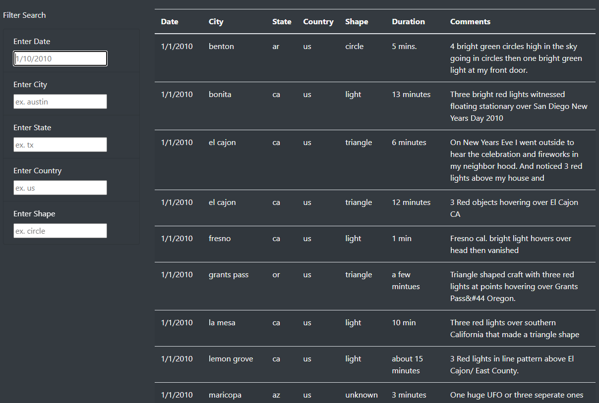

# UFOs
## Project Overview 
The purpose of this module and Challenge was to apply the HTML knowledge learned in module 10, along with new knowledge in programming with JavaScript, to create a web page that can actively "listen" to what the user is inputting to filter the data and display updated results for specific UFO sightings.
  

## Results
The data used for this webpage is stored in the JavaScript Array titled data.js. 

There are five different criteria that the table can be filtered by: date, city, state, country, and shape. By utilizing Bootstrap, these filters allow the user to dynamically update the webpage to automatically apply the filters to the data and display the updated table results. 

Shown below is the filters and start of the unfiltered data table. 

With these five filters, the user has lots of flexibility in how it can choose to look through the available data. Shown below are examples of the filters being used and how the results update. 

* **note** The country filter is not shown, as every data point in this array took place in the US, so filtering by US would not change the results.

* As you can see, when a date is entered in the correct format, after the user hits the Enter key, the table will automatically update with all (if any) available matching results. The same applies to all five filters created for this page.

 

